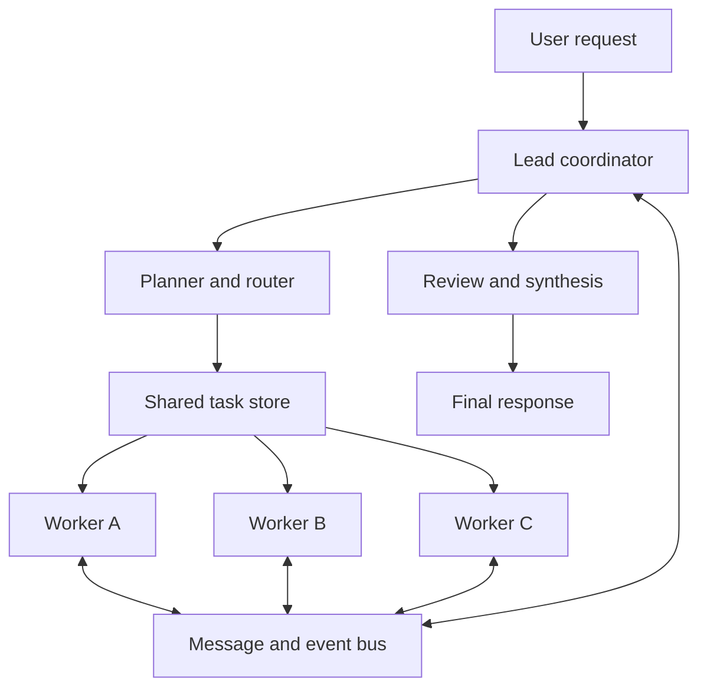
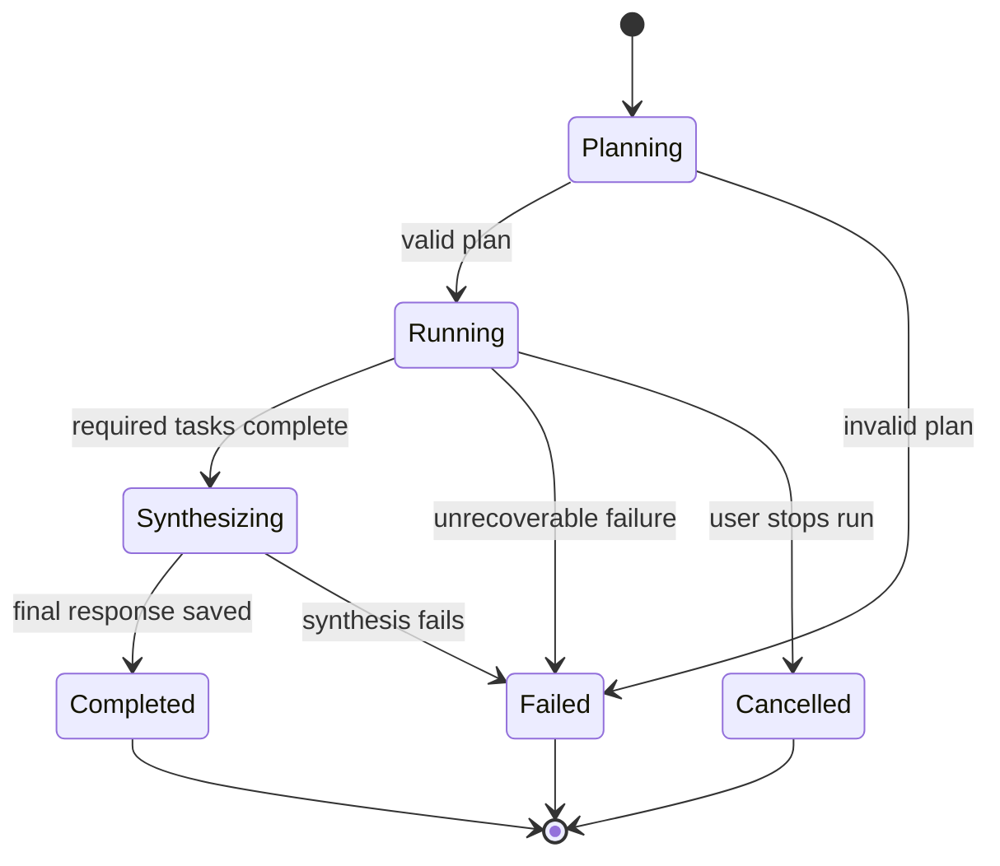

# Claude Code Split-Pane Multi-Agent System

## 1. Goal

Build a terminal-based coding-agent system that behaves like this:

1. The user enters one request in the main pane.
2. A lead agent analyses the request.
3. The lead decides whether the task needs zero, one, or several worker agents.
4. Each worker receives a separate responsibility.
5. Every active worker is displayed in its own terminal pane.
6. The lead and workers exchange structured messages and progress updates.
7. The lead waits for required work, reviews the results, and returns one final response.

The desired terminal layout is:

```text
+---------------------------+----------------------------+
|                           | Worker: researcher         |
|                           +----------------------------+
| Lead agent                | Worker: implementer        |
| Request, task list,       +----------------------------+
| messages, final response  | Worker: reviewer/tester    |
|                           |                            |
+---------------------------+----------------------------+
| Session name | run status | active agents | elapsed   |
+--------------------------------------------------------+
```

The terminal panes are only the presentation layer. Planning, task ownership,
communication, process lifecycle, and result synthesis must work even when no
multiplexer is available.

---

## 2. First decision: configure or build?

Claude Code already provides experimental **Agent Teams**. It includes:

- A team lead.
- Independent teammate sessions.
- A shared task list.
- Direct inter-agent messaging.
- An in-process display or one pane per teammate.

Therefore, use one of these tracks:

| Track | Use it when | Recommendation |
| --- | --- | --- |
| Native Claude Code Agent Teams | You mainly want the behavior shown in the screenshots | Start here |
| Custom workspace orchestrator | You need native `psmux`, custom agent selection, persistent runs, custom logs, provider switching, or your existing `coding-agent-workspace` commands | Build after validating the native workflow |

Do not build a terminal multiplexer. Use `tmux` or `psmux` through a small
adapter. Keep the orchestrator independent of either one.

---

## 3. Fastest route: native Claude Code Agent Teams

### 3.1 Important Windows limitation

Claude Code's official split-pane teammate mode currently requires real `tmux`
or iTerm2. Its documentation states that the split-pane mode is not supported
in Windows Terminal, VS Code's integrated terminal, or Ghostty.

`psmux` supplies many `tmux`-compatible commands on Windows, but it is not an
officially supported backend for Claude Code Agent Teams. Installing `psmux`
does not guarantee that Claude Code's native teammate mode will recognize it.

For the most reliable Windows setup, run Claude Code and real `tmux` inside
WSL 2. Keep the project in the Linux filesystem, such as
`~/projects/coding-agent-workspace`, when possible.

### 3.2 Install the reliable WSL 2 environment

Run in an Administrator PowerShell window:

```powershell
wsl --install -d Ubuntu
```

Restart Windows if requested. Then open Ubuntu and run:

```bash
sudo apt update
sudo apt install -y tmux git curl
curl -fsSL https://claude.ai/install.sh | bash
claude --version
claude doctor
tmux -V
```

Authenticate by running:

```bash
claude
```

Exit Claude after authentication.

### 3.3 Enable Agent Teams and pane mode

Add the following to `~/.claude/settings.json`. Merge these fields with any
existing settings; do not overwrite unrelated configuration.

```json
{
  "env": {
    "CLAUDE_CODE_EXPERIMENTAL_AGENT_TEAMS": "1"
  },
  "teammateMode": "tmux"
}
```

Start a tmux session, enter the project, and launch Claude Code:

```bash
tmux new-session -s coding-agents
cd ~/projects/coding-agent-workspace
claude --teammate-mode tmux
```

The `--teammate-mode` option is experimental and may not be listed by
`claude --help`.

### 3.4 First validation prompt

Paste this into the lead session:

```text
Create an agent team with exactly three named teammates:

1. researcher — inspect the repository and document its current architecture;
2. tester — inspect the test strategy and identify missing coverage;
3. reviewer — identify reliability, concurrency, and security risks.

This is an analysis-only exercise. Nobody may edit files.
Create a shared task for each teammate, let them communicate when their findings
overlap, wait until all three finish, and then synthesize one report containing:
- current architecture;
- important risks;
- recommended implementation order;
- evidence using file paths.
```

Expected result:

- The original Claude session remains the lead.
- Three teammate panes appear.
- Each teammate has a clearly different assignment.
- The lead receives teammate messages automatically.
- The lead waits and produces one consolidated answer.

### 3.5 Useful control prompts

```text
Show the shared task list and the owner of every task.
```

```text
Wait for every teammate to complete its assigned task before synthesizing.
```

```text
Ask the reviewer to challenge the implementer's approach and send its concerns
to both the implementer and the lead.
```

```text
Ask the tester teammate to shut down gracefully.
```

In the in-process display, use the arrow keys and Enter to inspect a teammate
and `Ctrl+T` to toggle the task list. In split-pane mode, select or click the
teammate's pane and interact with that Claude session directly.

---

## 4. Native Windows and `psmux`

After installing `psmux` with WinGet, fully close and reopen PowerShell because
the installer changes `PATH` and command aliases for future shells.

Verify it in the new shell:

```powershell
Get-Command psmux
Get-Command tmux
psmux --help
tmux new-session -s claude-work
```

If `psmux` works but the `tmux` alias does not, invoke `psmux` directly in the
custom terminal adapter. Do not make the application depend on an alias.

Use `psmux` for the custom orchestrator described below. Treat native Claude
Code Agent Teams on Windows Terminal as unsupported until a real validation
test succeeds on the exact Claude Code and `psmux` versions installed.

---

## 5. Custom system architecture

Use Node.js and TypeScript for the existing `coding-agent-workspace`. Use
`child_process.spawn` for process control and a terminal-multiplexer adapter for
pane creation.



Separate the system into these layers:

| Layer | Responsibility |
| --- | --- |
| CLI | Accept requests and commands such as `team`, `runs`, `show`, `message`, `stop`, and `attach` |
| Planner | Decide if parallelism helps, choose roles, create bounded tasks and dependencies |
| Coordinator | Own the run state machine, assignments, messages, cancellation, timeout, and synthesis |
| Claude runner | Start Claude Code safely, stream structured output, resume a worker, and collect its result |
| Run store | Persist plans, events, messages, prompts, outputs, status, and process metadata |
| Terminal adapter | Create, label, resize, focus, and close panes without knowing anything about agents |
| Worker host | Execute one assigned task, publish progress, receive follow-up messages, and return a result |
| Renderer | Display logs and status in panes; fall back to a single terminal when no multiplexer exists |

### 5.1 Critical design rule

Do not use terminal screen text as the communication protocol.

The visible pane may display output, but the coordinator must consume Claude
Code's structured process output and explicit event files. Never scrape ANSI
terminal output to determine whether an agent is finished.

---

## 6. Suggested project structure

```text
src/
  cli.js
  team/
    execute-team.js
    planner.js
    coordinator.js
    scheduler.js
    synthesizer.js
    run-state.js
  agents/
    registry.js
    worker-host.js
    claude-runner.js
    roles/
      researcher.md
      implementer.md
      reviewer.md
      tester.md
  messaging/
    event-bus.js
    mailbox.js
    schemas.js
  terminal/
    multiplexer.js
    tmux-adapter.js
    psmux-adapter.js
    headless-adapter.js
    layout.js
  store/
    run-store.js
    file-lock.js
  git/
    worktree-manager.js
  util/
    process.js
    ids.js
    logger.js
test/
  planner.test.js
  scheduler.test.js
  event-bus.test.js
  run-store.test.js
  layout.test.js
  process-cleanup.test.js
  team-integration.test.js
```

Persist each run under:

```text
.agent-workspace/
  runs/
    <run-id>/
      request.md
      plan.json
      status.json
      events.jsonl
      final-response.md
      agents/
        <agent-id>/
          task.json
          prompt.md
          status.json
          inbox.jsonl
          output.jsonl
          result.md
```

Write JSON files atomically by saving a temporary file and renaming it. Append
events as one JSON object per line. Use a lock when several processes may claim
or update the same task.

---

## 7. Core data contracts

Use runtime validation in addition to TypeScript types. Zod is suitable.

```ts
type RunStatus =
  | "planning"
  | "running"
  | "synthesizing"
  | "completed"
  | "failed"
  | "cancelled";

type TaskStatus =
  | "pending"
  | "blocked"
  | "running"
  | "completed"
  | "failed"
  | "cancelled";

interface AgentPlan {
  runId: string;
  summary: string;
  parallelismJustified: boolean;
  synthesisTaskId: string;
  agents: AgentAssignment[];
  tasks: AgentTask[];
}

interface AgentAssignment {
  agentId: string;
  role: "researcher" | "implementer" | "reviewer" | "tester" | "custom";
  objective: string;
  ownedPaths: string[];
  readOnly: boolean;
}

interface AgentTask {
  taskId: string;
  title: string;
  instructions: string;
  ownerAgentId: string;
  dependsOn: string[];
  acceptanceCriteria: string[];
  status: TaskStatus;
}

interface AgentEvent {
  eventId: string;
  runId: string;
  agentId: string;
  taskId?: string;
  timestamp: string;
  type:
    | "agent_started"
    | "progress"
    | "message"
    | "task_completed"
    | "task_failed"
    | "agent_stopped";
  payload: unknown;
}
```

The plan must be validated before any worker is launched:

- Every task has one owner.
- Every dependency references an existing task.
- The dependency graph has no cycle.
- Every writing agent owns a non-overlapping file set or an isolated worktree.
- The number of agents is within the configured limit.
- Every task has explicit acceptance criteria.

---

## 8. How the lead chooses agents

The lead must not create multiple agents merely to make the screen look busy.

Use these defaults:

| Request | Team choice |
| --- | --- |
| Explanation, tiny edit, or tightly sequential task | Lead only |
| One focused investigation that would pollute the lead context | One worker |
| Two or more independent research questions | Two or three workers |
| Frontend, backend, and tests with separate file ownership | Three workers |
| Uncertain bug with competing hypotheses | Three investigators plus one reviewer, if the budget allows |
| Several agents would edit the same file | One implementer; other agents review or test read-only |

Default maximum: four workers.

The planner should return a structured plan, not free-form prose. If its output
does not validate, retry once with the validation errors. If it still fails,
fall back to the lead-only workflow.

---

## 9. Git and file ownership

Parallel agents can easily overwrite each other's work.

For the first implementation:

1. Let only one agent edit code.
2. Run researcher, reviewer, and tester agents in read-only mode.
3. Let the lead apply or merge the final changes.

After the MVP is stable, add worktree isolation:

- Create one worktree and branch for each writing agent.
- Record the absolute worktree path and branch in the agent metadata.
- Start the worker with that worktree as its working directory.
- Require a clean, reviewable commit from each worker.
- Let the lead review and merge in dependency order.
- Never let two workers own the same path.
- Do not automatically delete a failed worktree; retain it for diagnosis.

---

## 10. Claude process runner

The runner should use `spawn`, pass arguments as an array, and send prompts
through standard input or a prompt file. Do not build one quoted shell command
containing the user request.

For non-interactive workers, use Claude Code's print mode and structured output.
Confirm the exact flags against the installed Claude Code version before
implementation. A typical invocation is:

```text
claude --print --verbose --output-format stream-json
```

Runner responsibilities:

- Set the worker's exact working directory.
- Pass the system/task prompt without shell interpolation.
- Stream stdout line by line.
- Parse and validate structured records.
- Save raw structured output for debugging.
- Forward normalized events to the coordinator.
- Capture stderr separately.
- Record PID, start time, exit code, signal, and end time.
- Support graceful cancellation before forced termination.
- Apply a configurable timeout.
- Never print credentials or inherited secret environment variables.

The first version may execute one Claude turn per worker. A later version may
resume a worker for follow-up messages using a recorded Claude session ID.

---

## 11. Inter-agent communication

Use a coordinator-mediated mailbox for the custom implementation:

```json
{
  "messageId": "msg_01",
  "from": "reviewer",
  "to": "implementer",
  "type": "question",
  "taskId": "task_02",
  "body": "How is cancellation handled if the child process ignores SIGTERM?",
  "createdAt": "2026-07-30T08:00:00.000Z"
}
```

Rules:

- Messages are append-only and include sender, recipient, task, and timestamp.
- A worker cannot modify another worker's inbox history.
- The coordinator delivers messages and records acknowledgement.
- Broadcasts are expanded into one message per recipient.
- Messages cannot grant permissions or expand another worker's scope.
- A worker that needs broader access must request it from the lead.
- The lead receives completion and failure events automatically.
- A dependent task becomes runnable only after all dependencies complete.

For the MVP, workers may communicate findings through the coordinator between
Claude turns. Do not attempt real-time peer chat until task execution, storage,
and cancellation are reliable.

---

## 12. Terminal multiplexer interface

Define one interface and implement three adapters:

```ts
interface TerminalMultiplexer {
  isAvailable(): Promise<boolean>;
  createSession(input: {
    sessionName: string;
    cwd: string;
    leadCommand: string[];
  }): Promise<{ sessionId: string; leadPaneId: string }>;
  createWorkerPane(input: {
    sessionId: string;
    agentId: string;
    title: string;
    command: string[];
  }): Promise<{ paneId: string }>;
  applyLayout(sessionId: string, workerCount: number): Promise<void>;
  focusPane(sessionId: string, paneId: string): Promise<void>;
  closePane(sessionId: string, paneId: string): Promise<void>;
  closeSession(sessionId: string): Promise<void>;
}
```

Implement:

1. `TmuxAdapter` for Linux, WSL, and macOS.
2. `PsmuxAdapter` for native Windows.
3. `HeadlessAdapter` that prints prefixed output in one terminal and does not
   create panes.

Detection order:

1. Explicit `--mux tmux|psmux|headless`.
2. `psmux` on native Windows.
3. `tmux` on Linux, WSL, or macOS.
4. Headless fallback.

Never silently replace a failed explicit adapter. If the user explicitly asks
for `--mux psmux` and it cannot start, return a diagnostic error.

### Pane layout policy

| Total visible agents | Layout |
| --- | --- |
| Lead only | One full-screen pane |
| Lead + 1 worker | Lead 60% left, worker 40% right |
| Lead + 2 workers | Lead 60% left, two workers stacked right |
| Lead + 3 workers | Lead 55% left, three workers stacked right |
| More workers | Keep lead left; paginate, create another window, or use headless logs |

Each pane title should include:

```text
<agent-name> | <role> | <task-status>
```

Resize only when a worker is added or removed. Do not continuously redraw the
whole layout.

---

## 13. Run state machine



Terminal panes are projections of this state. Closing a pane must not silently
mark a task complete.

---

## 14. CLI behavior

Extend the existing CLI with:

```bash
npm start -- team "Implement cancellation for all child processes"
npm start -- team "Review the authentication module" --max-agents 3
npm start -- team "Investigate the failing tests" --mux psmux
npm start -- runs
npm start -- show <run-id>
npm start -- output <run-id> <agent-id>
npm start -- message <run-id> <agent-id> "Check the timeout path"
npm start -- stop <run-id>
npm start -- attach <run-id>
```

Exit codes:

| Code | Meaning |
| --- | --- |
| `0` | Run completed successfully |
| `1` | Run or agent failed |
| `2` | Invalid user input or configuration |
| `3` | Multiplexer unavailable |
| `4` | Run cancelled |

---

## 15. Implementation roadmap

### Milestone 1 — headless orchestration

- Add schemas and a run state machine.
- Add the planner and deterministic fallback.
- Run two fake workers concurrently.
- Store plans, events, status, and results.
- Add unit tests for dependencies, cancellation, and failure.
- No panes and no real Claude calls yet.

Acceptance test: two simulated workers finish out of order, but synthesis starts
only after all required dependencies are complete.

### Milestone 2 — Claude runner

- Add one real Claude worker using structured output.
- Add streaming, timeout, cancellation, stderr capture, and exit-code handling.
- Redact sensitive environment values from logs.
- Test the runner behind an injectable process factory.

Acceptance test: a worker analyses a fixture repository and produces a saved,
validated result.

### Milestone 3 — `psmux`, `tmux`, and headless adapters

- Implement adapter capability detection.
- Create one lead pane and one worker pane.
- Add titles and deterministic layouts.
- Ensure pane failure does not corrupt run state.

Acceptance test: the same fake-agent integration test passes with headless mode
and the available multiplexer.

### Milestone 4 — planner-controlled teams

- Allow the planner to choose roles and worker count.
- Enforce the maximum-agent limit.
- Validate task dependencies and file ownership.
- Start independent tasks concurrently.

Acceptance test: a frontend/backend/test request produces three non-overlapping
assignments, while a one-file edit uses only one implementer.

### Milestone 5 — messages and steering

- Add per-agent inboxes.
- Add `message`, `stop`, and `attach` commands.
- Resume or re-prompt workers with new messages.
- Persist delivery and acknowledgement events.

Acceptance test: the reviewer asks the implementer a question, the implementer
answers, and both messages appear in the run history.

### Milestone 6 — worktree isolation and synthesis

- Give writing workers isolated git worktrees.
- Require tests and clean commits.
- Let the lead review outputs and synthesize the final answer.
- Preserve failed worktrees for manual inspection.

Acceptance test: two workers modify separate modules without touching the main
checkout; the lead reports both commit IDs and test results.

### Milestone 7 — recovery and hardening

- Detect abandoned processes and stale locks.
- Recover readable run history after a crash.
- Make stop operations idempotent.
- Add Windows quoting and path tests.
- Add maximum runtime, output size, and retry limits.
- Add an orphan-session diagnostic rather than killing unrelated sessions.

---

## 16. Tests Claude Code must implement

At minimum:

- Planner chooses lead-only mode for a trivial task.
- Planner caps worker count.
- Cyclic task dependencies are rejected.
- Two agents cannot claim the same task.
- Two writing agents cannot own the same path.
- Events from concurrent writers remain valid JSONL.
- A worker failure is visible to the lead.
- A required worker failure prevents normal synthesis.
- An optional reviewer failure can be reported without losing successful work.
- Cancellation stops workers and records the final state once.
- Timeout does not leave an untracked process.
- Pane closure does not imply task completion.
- Missing `psmux` or `tmux` falls back only when the adapter was not explicit.
- User text containing quotes, newlines, `$()`, backticks, or PowerShell
  metacharacters is passed as data and never executed by the shell.
- An existing dirty worktree is preserved.
- A failed run remains inspectable with `show` and `output`.

---

## 17. Paste-ready master prompt for Claude Code

Run Claude Code from the root of `coding-agent-workspace`, then paste:

```text
I want you to extend this repository into a split-pane multi-agent coding
workspace.

Product behavior:
- A user submits one request to a lead coordinator.
- The lead decides whether parallel workers provide real value.
- The lead creates a validated task graph, chooses named agent roles, assigns
  one owner per task, and starts independent tasks concurrently.
- Each active worker is shown in a separate terminal pane.
- Workers publish structured progress and results and can exchange messages
  through a coordinator-managed mailbox.
- The lead waits for required work, reviews the evidence, and writes one final
  synthesized response.

Technical direction:
- Preserve the current Node.js project structure and existing CLI behavior.
- Inspect the repository before proposing changes.
- Use child_process.spawn with argument arrays; never interpolate user input
  into shell command strings.
- Treat terminal panes only as a view. Do not parse pane text as a protocol.
- Persist each run under .agent-workspace/runs/<run-id>/ with request, plan,
  status, JSONL events, per-agent prompts/output/results, and final response.
- Add a TerminalMultiplexer interface with TmuxAdapter, PsmuxAdapter, and
  HeadlessAdapter implementations.
- Invoke psmux directly on native Windows; do not rely on its tmux alias.
- Use Claude Code print mode with structured streaming output for workers,
  after confirming supported flags on the installed version.
- Validate plans at runtime: valid agent count, unique task ownership, acyclic
  dependencies, acceptance criteria, and non-overlapping file ownership.
- Start with only one writing agent; keep researcher, reviewer, and tester
  read-only. Add git-worktree isolation only after the headless MVP is reliable.
- Support clean cancellation, timeout, process exit tracking, and inspectable
  failed runs.
- Preserve all unrelated and existing user changes.

Required CLI:
- team "<request>" [--max-agents N] [--mux auto|tmux|psmux|headless]
- runs
- show <run-id>
- output <run-id> <agent-id>
- message <run-id> <agent-id> "<message>"
- stop <run-id>
- attach <run-id>

Implementation method:
1. Inspect package.json, source files, tests, and git status.
2. Write an implementation plan mapped to the existing modules.
3. State assumptions and risks before editing.
4. Implement only Milestone 1: headless orchestration with fake workers.
5. Add focused tests for the task graph, concurrency, run persistence,
   cancellation, and failure.
6. Run syntax checks, tests, git diff --check, and show the resulting diff.
7. Stop and report what was completed, what remains, and the exact next
   milestone. Do not begin the Claude runner or multiplexer adapters until I
   review Milestone 1.

Acceptance criteria for Milestone 1:
- A trivial request produces lead-only execution.
- A parallelizable fixture request produces at least two independent tasks.
- Fake workers can complete out of order.
- Synthesis waits for required dependencies.
- A failed worker is recorded and visible.
- Cancellation is idempotent and leaves no fake workers running.
- Existing commands and tests still pass.
```

After reviewing Milestone 1, use this continuation prompt:

```text
Continue with Milestone 2 only: implement the real Claude subprocess runner
behind the same worker interface. Preserve the fake runner for deterministic
tests. First verify the installed Claude Code version and supported structured
output flags. Add timeout, cancellation, stderr capture, session metadata,
stream parsing, schema validation, and secret-safe logging. Do not implement
tmux or psmux yet. Run all verification commands and stop with a focused diff
and handoff.
```

Then:

```text
Continue with Milestone 3 only: implement HeadlessAdapter, TmuxAdapter, and
PsmuxAdapter behind TerminalMultiplexer. Detect commands safely, invoke psmux
directly on Windows, keep the pane layer independent of orchestration, and add
adapter contract tests. Do not add worktrees or peer messaging yet. Verify the
layout for one, two, and three workers, then stop with test results and the
remaining risks.
```

---

## 18. Definition of done

The system is complete when:

- A single command accepts a natural-language task.
- The plan clearly explains why each worker exists.
- Independent workers actually run concurrently.
- Every worker has a visible pane or a clear headless fallback.
- The lead and workers use structured state, not terminal scraping.
- File ownership prevents agents from overwriting one another.
- The lead waits for all required work.
- The final answer contains task results, failures, tests, and changed files.
- Every run can be inspected after completion or failure.
- Stop and cancellation leave no untracked processes or unexplained panes.
- The full test suite passes on the target Windows environment.

---

## 19. Official references

- [Claude Code Agent Teams](https://code.claude.com/docs/en/agent-teams)
- [Claude Code parallel-agent approaches](https://code.claude.com/docs/en/agents)
- [Claude Code custom subagents](https://code.claude.com/docs/en/sub-agents)
- [Claude Code settings](https://code.claude.com/docs/en/settings)
- [Claude Code setup, including Windows and WSL](https://code.claude.com/docs/en/setup)

Agent Teams are experimental, use more tokens than a single session, and have
known limitations. Recheck the official documentation when upgrading Claude
Code because teammate display and lifecycle behavior may change.
